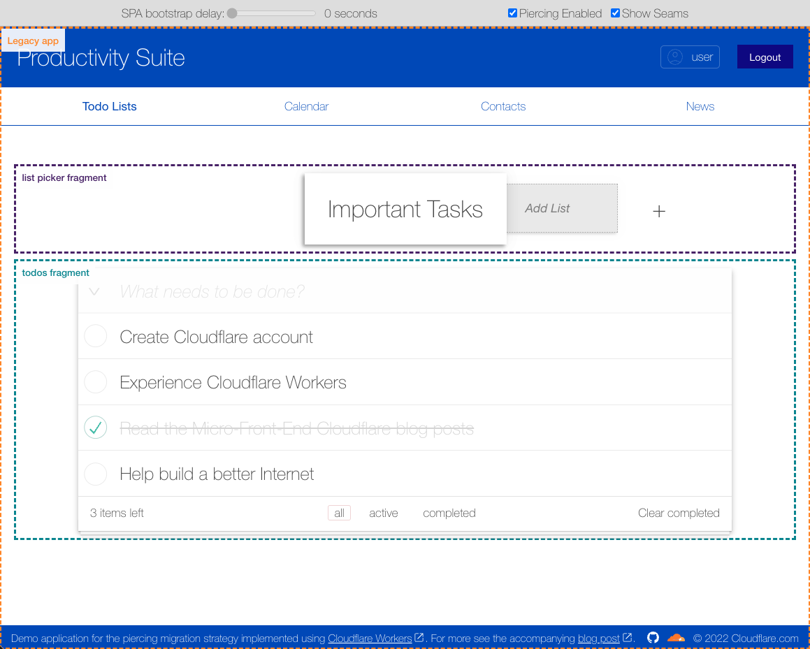

# Productivity Suite Demo



This project demonstrates what we've called the "Migration Piercing Strategy", which consists in a strategy aimed to the incremental migration of a legacy application to a server side rendering model implemented at the edge via Cloudflare Workers.

To read more about it see the [Incremental adoption of micro-frontends with Cloudflare Workers](https://blog.cloudflare.com/fragment-piercing/).

To view the application visit: https://productivity-suite.web-experiments.workers.dev.

## Project Structure

The following tree represents the project's file structure:

```
productivity-suite
|-- app
|    |-- fragments
|    |    |-- login
|    |    |-- todo-lists
|    |    |-- todos
|    |    +-- news
|    |
|    |-- legacy-app
|    +-- shared
|
|-- piercing-library
|
+-- scripts
```

In which:

- `scripts` simply contains utility node scripts
- `piercing-library` contains the library implemented for the piercing strategy. It is not a fully fledged npm library but it could potentially be the base for one. All the content of this directory is generic and independent of the application's logic (and could be reused for any application).
- `app` contains the productivity suite application specific elements (not generic/reusable) which are:
  - a local `shared` library used by the legacy application and the fragments
  - the `legacy-app` application
  - the set of `fragments`

## How to run the app locally

- Install the workspace:

  ```
  npm i
  ```

- Run the whole app for local development:

  ```
  npm start
  ```

---

The above script runs all the necessary processes and opens the browser to the specific port where the app is served.

Alternatively you can run all the processes manually in separate terminals in the following way:

- Build all the necessary packages:

  ```
  npm run build
  ```

  (if you want to work on the libraries you can go into `/piercing-library` and/or `/app/shared` and run `npm run build.watch` to have them build in watch mode)

- Serve the legacy app:

  ```
  cd app/legacy-app
  npm run dev.react
  npm run dev.worker (in a separate terminal)
  ```

- Serve the fragments:

  ```
  cd app/fragments/fragmentName
  npm run dev
  ```

  where `fragmentName` is `login`, `todo-lists`, `todos` or `news`

- Open the browser at: http://localhost:8987

## How to deploy the app

If you want you can deploy your version of the application using your Cloudflare account.

To do so you need update the value of the `account_id` present in all the `wrangler.toml` files and the `CLOUDFLARE_ACCOUNT_ID` present in the `deploy.react` script in `productivity-suite/app/legacy-app/package.json` with your cloudflare account id (this only needs to be done once).

After that in the `productivity-suite` directory you can simply run

```
npm run deploy
```

to deploy all the fragments and legacy application.

After the deployment is completed you should be able to access the application at: `https://productivity-suite._YOUR_ACCOUNT_DOMAIN_.workers.dev`.

## Extra

We discuss different limitations related to the current implementation, and possible areas of improvements in the [Limitations and area of improvements document](./limitations-and-improvements.md).
